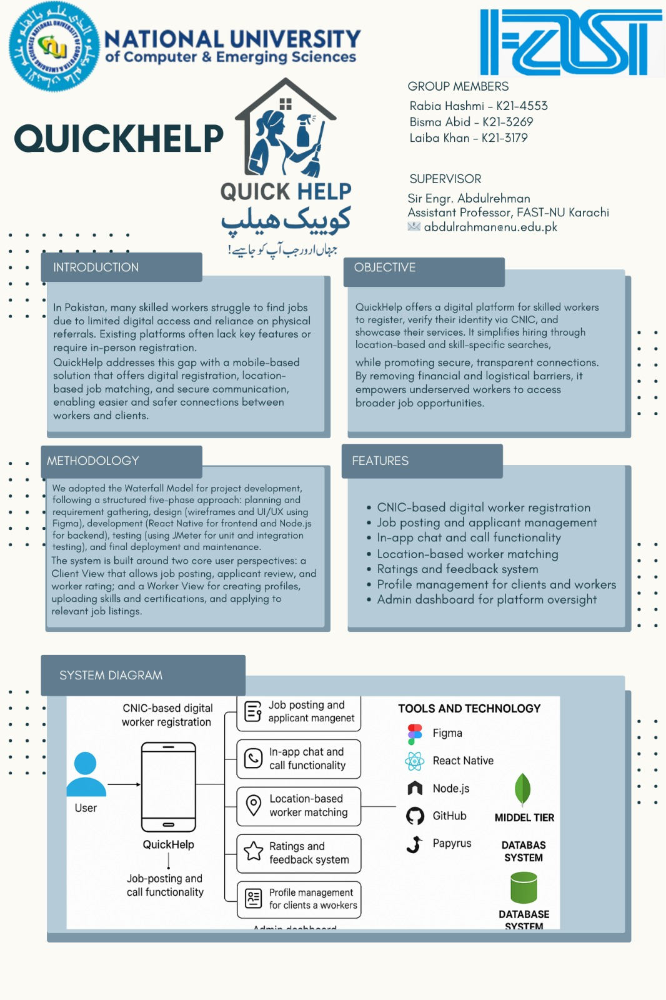

# QuickHelp

**QuickHelp** is a mobile and web-based platform developed as a Final Year Project at FAST NUCES, Karachi. It connects clients with verified local service providers, simplifying the booking and management of household and event-related services such as catering, decoration, domestic help, and more.

## 📌 Project Overview

QuickHelp addresses the gap in digital service hiring by offering a user-friendly solution for both clients and skilled workers. The platform supports:

- Real-time job matching via geolocation
- CNIC-based user verification
- In-app chat and booking system
- Ratings and reviews for trust-building
- Role-based access for clients, workers, and admins

## 🛠️ Tech Stack

- **Frontend:** React Native (mobile), React.js (web)
- **Backend:** Node.js
- **Database:** Firebase (Firestore, Auth)
- **APIs:** Google Maps, OpenStreetMap, ImageBB, OCR

## 🔑 Features

### Client Panel
- Register/login and manage profiles
- Search, filter, and book services
- Track job status and communicate with providers
- Rate and review after service completion

### Service Provider Panel
- Create and manage service listings
- Update availability, respond to job requests
- View ratings and interact with clients

### Admin Panel
- Approve new users and job requests
- Assign workers and manage roles via RBAC
- Track platform activities and status updates

## 📽️ Project Demo

📺 [Watch Demonstration Video](https://drive.google.com/file/d/1GRnveuKGylo-fRcSKWPsWRVOmOI7srSb/view?usp=drive_link)  

📁 All items are shared in the [Google Drive Folder](https://drive.google.com/drive/folders/1UWileajjKLWo9R9b_b5xmI-EKEE3ZIo9)  

## 👩‍💻 Team Members

- **Syeda Rabia Hashmi** – 21K-4553
- **Bisma Abid** – 21K-3269   
- **Laiba Khan** – 21K-3179  

**Supervisor:** Asst. Prof. Engr. Abdul Rahman  
**Institution:** FAST School of Computing, NUCES Karachi  
**Submission Date:** 15 May 2025

